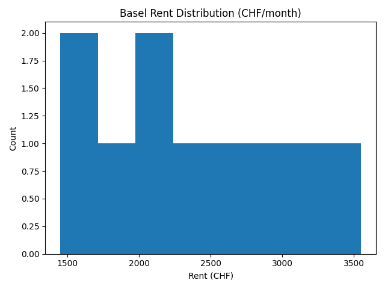
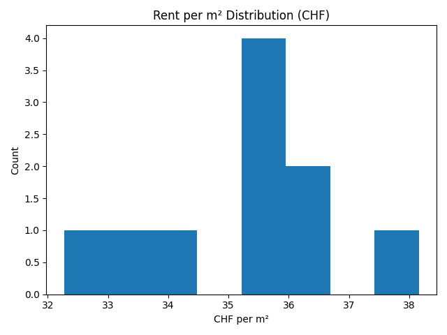
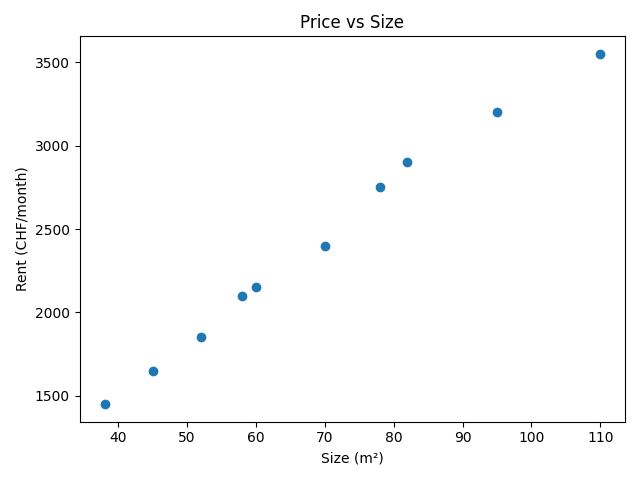

# Basel Rent Analysis 🏙️

Exploratory analysis of Basel rental listings to understand price drivers (location, size, rooms, amenities) and typical rent ranges.

## Goal
- Build a clean dataset of rental listings
- Explore rent distributions & key drivers
- Create visuals that answer “what should I expect to pay in Basel?”

## Data
Source: Public rental listings (scraped or manually collected).  
> Note: This repo uses either a small sample dataset or instructions to reproduce the dataset to respect site terms.

## Key questions
- How do rents vary by neighborhood/postal code?
- What is the rent per m² distribution?
- Which features (rooms, size, amenities) correlate most with price?
- What rent range is “typical” for common apartment types?

## Project structure
basel-rent-analysis/
data/
raw/ # local raw data (not committed)
processed/ # cleaned data (not committed)
notebooks/
01_eda.ipynb # main exploratory analysis
src/
cleaning.py # small cleaning helpers
outputs/
figures/ # exported charts
requirements.txt
README.md

---

## Data
This repo is designed to work with:
- a small sample dataset (for demo), OR
- your own collected dataset (recommended)

To avoid issues with site terms and privacy, raw listing data is kept local and not committed to GitHub.

---

## How to run (local)
1) Install dependencies:
```bash
pip install -r requirements.txt
```
2) Start Jupyter
```bash
jupyter lab
```
4) Open:
```bash
notebooks/01_eda.ipynb
```

## Outputs (example)





## Quick takeaways (from the sample)
- Rents cluster around ~1,600–3,500 CHF/month in this small demo sample.
- Rent per m² varies noticeably, which hints that location/amenities matter beyond size.
- Price increases with size, but not perfectly - there’s scatter (again: likely area/quality effects).
